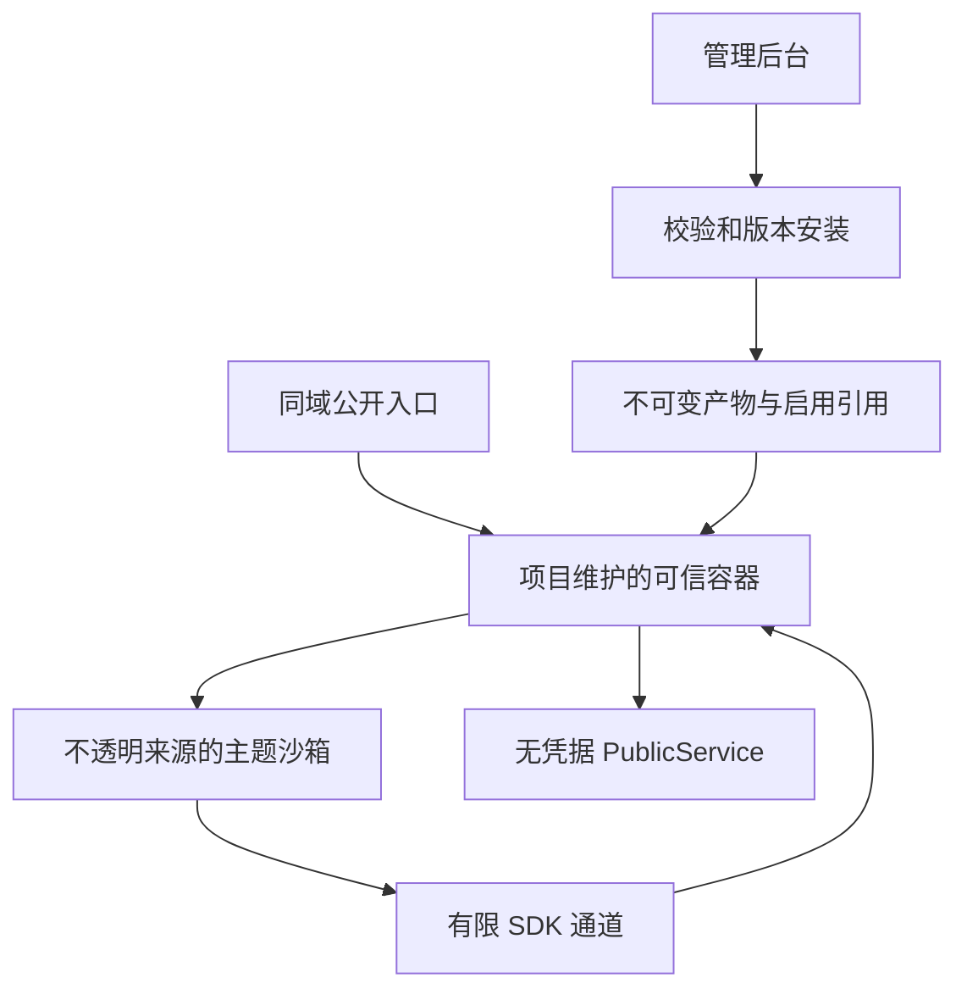
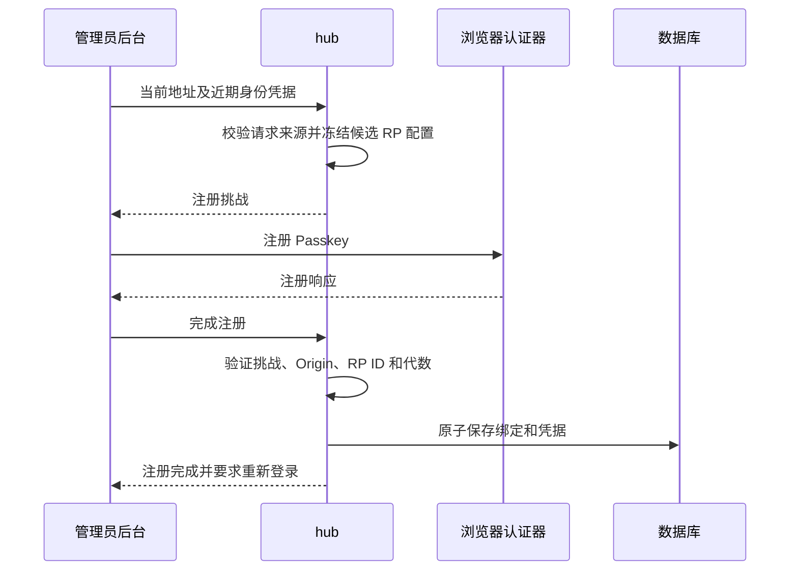
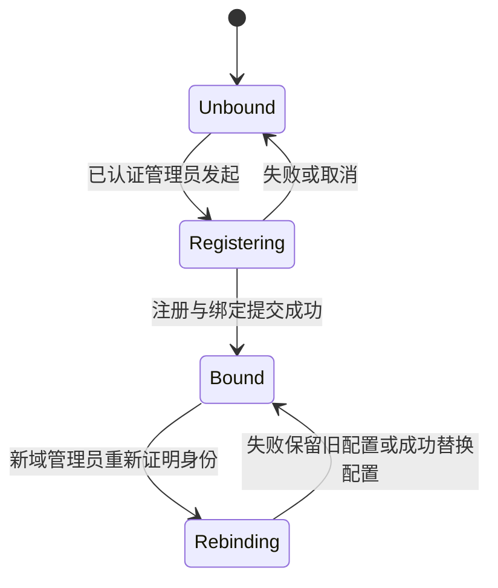

# Theme Management and Passkey Binding

## Goal Capsule

**Objective:** 管理员在一个访问域名的后台完成主题安装、预览、切换、回滚及 Passkey 注册，不再为这两项能力手填独立主题域名和认证域名。

**Means:** 受限主题运行容器、版本化主题安装，以及首次成功注册时持久化的 Passkey 域名绑定，见 KTD1 至 KTD6。

**Authority:** 用户确认的产品要求优先；本方案规定行为与验收边界，具体函数和表结构由实现确定。

**Execution:** 本文只授权规划。后续实现须单独取得授权；不自动提交、推送、部署。实现者负责全链路验证，不以单元测试通过替代浏览器隔离与 WebAuthn 验收。

**Stop Conditions:** 如果真实浏览器不能同时满足主题运行和权限隔离，不得通过增加同源权限或放宽管理 API 来交付；须报告证据并调整设计。已有凭据缺少可信原始 RP 配置时，不得根据访问请求猜测迁移。

---

## Product Contract

### Summary

公开首页和管理后台使用同一域名，主题在后台安装并切换，GitHub 仅提供下载来源。Passkey 自动采用管理员当前访问的 HTTPS 地址，首次成功注册时绑定，换域名时通过后台重新认证、重新绑定并注册。

### Problem Frame

当前主题管理在没有独立 theme origin 时整体关闭，管理员必须先改部署才能使用。主题更新覆盖当前包，不能先验证再切换或回滚。Passkey 已存在，但依赖手工设置 `--admin-origin`，增加了部署配置负担。

### Key Decisions

- **同域后台管理。** 不再要求第二个主题域名。Governs R1, R2。（session-settled: user-directed; chosen over 独立主题主机名: 减少部署和切换成本。）
- **保留第三方 JS 和布局能力，采用沙箱及 SDK。** 接受旧主题需要适配，而不是把主题限制成配色模板。Governs R3, R4。（session-settled: user-approved; chosen over 纯声明式主题: 保留主题自由度。）
- **首次注册绑定单一认证域名。** 不随任意访问地址变化，也不提供多域凭据组。Governs R7, R8, R9。（session-settled: user-approved; chosen over 多域分别注册: 降低配置与凭据管理复杂度。）

### Requirements

**Theme Management**

- R1. `https://example.com/` 展示启用主题，`/admin/` 保持项目自身的管理界面；切换不改 URL、不重启 hub。
- R2. 后台接受公开 GitHub 仓库或 Release 链接，列出可用 Release 和主题 ZIP 资产，明确选择版本后安装；保留本地 ZIP 上传。hub 不拉源码、不运行构建脚本。
- R3. 支持隔离的交互预览、启用、停用、切回内置页和上一版本回滚。预览不改变公开页，启用后新访问和刷新使用新版本；已打开页面不强制热更新。
- R4. 第三方主题只能使用公开数据能力，不能读取面板 DOM、会话、凭据或代调用管理 API。安装、恢复、预览、直接打开主题文件均遵循同一准入和运行限制。
- R5. 安装新版本不影响当前主题。网络、校验或持久化失败时当前版本保持可用；GitHub 不可访问不影响已安装主题服务。
- R6. 公开页总闸继续控制公开页面、数据和主题文件；关闭时交互预览也禁用。主题标题、节点深链接、前进后退及移动端布局必须可用。

**Passkey**

- R7. 首次添加 Passkey 自动采用当前可用的 HTTPS Origin，无须手填域名；界面同时检查安全上下文与 WebAuthn 支持。localhost 开发例外单独提示，不把普通 HTTP 或任意 IP 视作可用 HTTPS 域名。
- R8. 首次注册成功时才保存规范化 Origin 和 RP ID；挑战创建或浏览器取消不占用绑定。注册前沿用现有重新证明身份要求。
- R9. 登录、注册、重新认证都使用已绑定配置和各自挑战快照。不同域名访问时明确提示不匹配，不能自动覆盖绑定。
- R10. 管理员在新域名以密码及已启用的第二因素进入后台后，可重新绑定并注册。新凭据成功写入时才替换绑定、移除旧域 Passkey、作废旧挑战及旧会话；失败保持原状态。
- R11. 可信代理配置缺失、HTTP、浏览器不支持、域名不匹配分别显示原因；不把前端自报 HTTPS 当作服务端可信事实。

### Scope Boundaries

不建设主题商店、评分系统、私有 GitHub 凭据管理或自动升级；先满足公开 Release 安装与本地上传。首次绑定仅支持一个精确管理 Origin，不自动提升为父域 RP ID，不扩展多域共享登录。

不承诺未适配 SDK 的旧主题在新沙箱中正常运行，也不以关闭沙箱兼容它。`--public-dir` 仍是部署者明确提供的可信静态站点覆盖，不用来运行从主题管理安装的第三方包；它与托管主题启用互斥，后台解释冲突，而非显示启用成功但不生效。

### Acceptance Examples

- AE1. 从 GitHub 安装 B 时公开页仍展示 A；预览 B 不影响访客；点击启用后刷新首页及节点深链接均展示 B。
- AE2. B 的下载失败或 ZIP 非法，A 的内容、启用引用及缓存保持不变；断网后 A 仍正常显示已有公开数据。
- AE3. 管理员登录后打开恶意主题，主题尝试访问面板、伪造桥接消息及调用管理 API，均不能读取敏感内容或产生管理副作用。
- AE4. 未配置 `--admin-origin` 的新安装经可信 HTTPS 反代访问，注册 Passkey 后重启 hub，仍可用该 Passkey 登录。
- AE5. 在另一域名访问已有绑定的 hub，现有 Passkey 不被挪用；新域重新注册取消或失败不损坏旧域凭据，成功后旧挑战和旧凭据均不可再用。

---

## Planning Contract

### Current Evidence

- `internal/hub/store/theme.go` 的 `PutTheme` 覆盖同 ID 包并保留启用状态；现有 revision 用于备份，不是可回滚的安装版本。
- `internal/hub/store/snapshot.go`、`internal/hub/backup/themes.go` 已按 SHA256 冻结包引用；`docs/theme-guide.md` 的按 ID 覆盖远端包描述与代码不一致，应随迁移校正。
- `cmd/hub/serve.go` 按主机名分流；`internal/hub/api/themes.go` 在共享准入函数限制全部主题管理方法；`internal/hub/web/dir.go` 的 CSP 禁止嵌入。
- `internal/hub/auth/security.go` 已有注册、登录、重新认证、一次性挑战及认证配置代数；WebAuthn 配置只在启动时创建，凭据未记录独立绑定信息。
- `internal/hub/auth/proxy.go` 的 `RequestScheme` 仅面向当前 cookie 行为，接受可信对端传来的首个转发协议值；不能不加审查直接升级为认证域名的信任依据。
- 前端管理页与公开页分别构建并嵌入二进制；现有 Vitest/jsdom 无法证明沙箱、CSP 和 WebAuthn 的浏览器行为。

以上是静态代码依据，不是运行验证。本方案不声称沙箱或浏览器兼容性已通过实验；U1 首先取得真实浏览器证据。

### Key Technical Decisions

- KTD1. **由可信页面容器承载主题。** R1、R3、R4 使用不带 `allow-same-origin` 的受限 iframe，仅开启运行主题所必需的脚本权限。不得开启顶层导航、弹窗逃逸、表单提交、下载或 WebAuthn 权限。主题 HTML 响应本身也携带 CSP sandbox，使直接打开包内页面不能获得面板同源权限。路径划分本身不承担隔离。
- KTD2. **建立有限的公开数据桥接。** 主题 SDK 只提供现有四个 PublicService 操作及公开路由同步，不接受任意 URL、RPC 名、HTTP 方法、头或脚本。可信容器以无凭据请求获取公开数据。消息校验来源窗口、专属通道、版本、结构、尺寸与速率；不能仅凭 `origin === "null"` 放行。切换、导航和销毁时撤销旧通道并取消未完成请求。
- KTD3. **主题文件策略与管理接口策略分离。** HTML、SVG 等可形成文档的响应不能出现无 sandbox 的旁路；固定 MIME、nosniff，禁止 worker、对象及嵌套文档。模块、字体等若需要 CORS，仅对允许公开读取的不可变静态资源开放无凭据读取；不对管理 API 或整个站点开启 `null`/通配 Origin。管理认证入口统一拒绝沙箱来源的请求，并验证写请求来源，不依赖浏览器“读不到响应”防止副作用。
- KTD4. **安装实体与启用引用分离。** 主题 ID 表示主题，包摘要表示不可变安装产物，版本字符串仅作展示。主题记录来源仓库、Release/asset 标识和下载摘要；来源更新必须匹配目标主题 ID。全站启用指针单独保存，事务完成后更新缓存代数；页面及资源固定同一个摘要，避免切换混用文件。保留最多 20 个主题、每主题最多 3 个安装产物；超限要求显式删除未使用版本，不隐式覆盖当前或回滚版本。备份冻结全部保留产物和启用引用，恢复不得重新请求 GitHub。
- KTD5. **包安全解析与执行能力分层。** 新清单声明 SDK 协议版本；上传、下载、恢复共用包结构、路径、大小和摘要校验。新安装必须支持当前 SDK；缺失或不支持 SDK 的迁移旧包只可归档和恢复，预览、启用及文件执行入口共用执行准入并明确拒绝它。下载只允许解析后的公开 GitHub Release 资产，限定 HTTPS 目标及重定向范围，逐跳检查 DNS/拨号地址，拒绝回环、私网、链路本地及元数据地址；超时、压缩/解压大小和条目限制沿用现有边界。摘要用于本地不可变身份，不把它表述为作者可信认证。
- KTD6. **绑定只由成功注册事务确立。** R7 至 R10 的候选 Origin 来自当前浏览器地址，但服务端须与请求 Origin、规范 Host、可信外部协议一致性检查后才创建挑战。RP ID 为规范 hostname，不含端口，不自动扩大到父域；Origin 保留有效非默认端口。首次注册/重新绑定的候选配置属于挑战快照，最终由 WebAuthn 验证并与凭据原子提交。匿名登录只读已保存绑定，不能初始化它。
- KTD7. **可信外部请求信息统一解析。** 仅采信可信 TCP 对端且由反代覆盖写入的协议信息；对冲突、重复或含糊协议值拒绝认证绑定，不从客户端任意 Forwarded/X-Forwarded-Host 推导可信来源。配置、cookie、安全信息响应及认证挑战沿同一规范化口径，覆盖 IDNA、大小写、默认端口和非法主机名。反代须保留外部 Host 并覆盖转发协议，文档提供配置与诊断。
- KTD8. **所有认证流程绑定配置代数。** 登录、注册、重新认证和重新绑定挑战都冻结精确 Origin、RP ID、用途、会话/来源、过期时间和配置代数；完成时不可读取另一个请求刚替换的全局 WebAuthn 配置。继续使用现有并发准入、限流和一次性消费语义。重新绑定的提交与凭据替换、代数推进和会话撤销同一事务完成。

### High-Level Technical Design

### Migration and Operations

旧主题迁移成不可变产物；不支持新 SDK 的包保留可下载原包与元数据，标为需要适配，不在同域执行。原启用包不兼容时回落内置页并在后台明确提示。新版本移除独立主题托管路径和 `--theme-origin` 配置，安装脚本、服务示例、旧 flag 测试与文档同步更新；升级前说明移除该参数，不能默默忽略它继续按另一种路由服务。

新安装不需要 `--admin-origin`。已有部署仅在“已有 Passkey、没有持久绑定且具有可信原始配置”时，使用原参数校验并一次性导入绑定；尚无凭据的部署仍保持未绑定，首次成功注册才落库。持久绑定存在后，数据库是唯一生效来源，旧参数不再参与认证配置，只提示应移除；它既不能覆盖绑定，也不能阻止后台换域后的服务重启。既有 Passkey 没有可信原始配置时禁用其使用并提示从原部署配置恢复或通过密码及第二因素重新绑定，不猜测 RP ID，也不直接删除凭据。无需手动配置的新安装不走这条迁移路径。

备份保留认证绑定与凭据的关联。恢复到不同域名时按不匹配处理，不因恢复自动授权当前请求域名；保留现有终端认证恢复能力，不能把删除全部认证器当作正常换域操作。

---

## Implementation Units

### U1. Browser Boundary and Theme SDK

**Goal / Requirements:** 建立可验证的主题执行边界，覆盖 R3、R4、R6 和 KTD1 至 KTD3。无前置依赖。

**Files:** `internal/hub/web/theme.go`、`internal/hub/web/theme_test.go`、`internal/hub/web/web.go`、`internal/hub/api/service.go`、新增主题 SDK 与可信容器模块及同名测试；新增 `web/e2e/theme-sandbox.spec.ts` 和浏览器测试配置。

**Approach:** 先用最小真实主题验证模块加载、公开数据通信和隔离同时成立，再实现共享容器及消息协议。公开页和管理预览共用协议，不各写一套。前端路由只接受公开路径，主题内容不作为父页面 HTML 注入。精确静态资源策略在浏览器验证后定稿，不通过整站 CORS 兜底。

**Test Scenarios:**
- Covers AE3. 登录管理员打开恶意主题，尝试读取父 DOM、cookie、存储、注册 service worker、调用管理读写接口及发起 WebAuthn，不能获得管理权限或副作用。
- 直接打开 HTML、SVG、错误页、SPA 回落路径和缓存响应，均不能绕过文档 sandbox；移除响应 sandbox 的缺陷注入必须使对应断言失败。
- 真实 ES module、动态 import、CSS、字体及图表主题可运行；资源加载失败与安全拒绝分别可诊断。
- 旧 iframe、其他窗口、非法消息、任意方法名及路径逃逸不能调用桥接；资源 CORS 放行不能扩散到管理 API。
- Covers R6. 节点深链接刷新、前进后退、移动端滚动与关闭公开页生效。

**Verification:** 真实浏览器观察到允许的主题功能和被拒绝的攻击；只有 jsdom 结果不算完成。

### U2. Versioned Installation and Backup

**Goal / Requirements:** 覆盖 R3 至 R5、KTD4、KTD5；新格式取决于 U1 的协议。

**Files:** `internal/hub/theme/theme.go`、`internal/hub/theme/theme_test.go`、`internal/hub/store/schema.go`、`internal/hub/store/theme.go`、`internal/hub/store/theme_migration_test.go`、`internal/hub/store/snapshot.go`、`internal/hub/store/snapshot_test.go`、`internal/hub/store/restore_themes.go`、`internal/hub/store/theme_backup_test.go`、`internal/hub/backup/themes.go`、`internal/hub/backup/themes_test.go`。

**Approach:** 以摘要标识内容，重做安装、启用、删除和预览读侧口径；快照引用、恢复预检、备份状态及缓存同时迁移。旧包按迁移规则保留而不隐式执行。

已公开启用过的保留产物继续通过摘要路径提供静态资源，直到显式删除，供已打开页面加载旧版资源；仅安装或仅预览过的产物不因此公开。删除前提示可能中断仍打开的旧页面。公开总闸同时覆盖历史公开产物，不能只拦当前版本。

**Test Scenarios:**
- 上传同 ID 新版本不切换当前产物；相同包重复安装幂等，同版本字符串不同内容仍可区分。
- 启用和回滚原子更新；并发启用、删除及请求读取不能产生缺文件或跨版本资源混用。
- 达到主题数/版本数上限明确拒绝新增，当前版本不被自动删除。
- Covers AE2. 校验或事务失败，启用引用和缓存保持不变。
- 备份并发安装/切换时引用自洽；删除本地版本后旧快照仍能恢复；缺包、摘要不符、SDK 不兼容不能激活。
- 已迁移的不兼容旧包可以随新快照完整备份和恢复，但通过预览、启用或直接文件入口均不可执行；反向对照为兼容包恢复后可以显式启用。

**Verification:** 从旧 schema 和真实快照夹具迁移、备份、恢复后，在公开入口看到正确的版本或明确内置回退。

### U3. GitHub Import and Admin Controls

**Goal / Requirements:** 覆盖 R1 至 R6、KTD2、KTD4、KTD5，依赖 U1、U2。

**Files:** `proto/heron/v1/admin.proto`、`proto/heron/v1/public.proto`、`internal/hub/api/themes.go`、`internal/hub/api/themes_test.go`、新增 `internal/hub/theme/github.go` 与 `github_test.go`、`web/src/pages/Themes.tsx`、`web/src/pages/Themes.test.tsx`、`web/src/public/router.tsx`、`cmd/hub/serve.go`、`cmd/hub/theme_mux_test.go`、`cmd/hub/public_switch_test.go`、两侧生成客户端。

**Approach:** 后台呈现来源、版本、当前/上一版/待启用状态及安装进度；由服务端查询和安装选定 Release 资产。安装状态与公开激活状态分离，客户端重试不能重复或悄悄启用。交互预览仅让已认证管理员取得所选版本的受限访问能力，不公开所有未启用包。

版本列表提供版本级删除：保护当前版和上一回滚版，未使用版本可经确认删除；达到容量上限时直接引导清理并重试原安装。整个主题的删除与版本清理分开，不能为腾出一次升级空间而要求删除当前主题。

**Test Scenarios:**
- Covers AE1. 仓库查询、选择 Release/资产、安装、预览、启用、回滚与内置切换完成全流程。
- 多个 ZIP、不含主题资产、预发布、GitHub 限流/超时均明确呈现，不擅自选任意文件。
- 重定向到内网、DNS 地址变化、超大响应、解压炸弹和错误主题 ID 不能进入安装表。
- 预览资格过期、切换版本及退出后台后撤销预览访问能力；公开访客不能访问从未公开的待启用产物。
- 安装第四个产物触发容量提示后，从后台清理未使用版本并重试成功，当前和上一回滚版不受影响。
- 已打开旧版页面在切换后仍能加载其保留产物的动态资源；从未公开的待启用包仍需预览授权。
- 公开关闭和 `--public-dir` 冲突分别有明确状态；所有入口遵循同一服务端判定。

**Verification:** 从管理后台完成安装到公开入口回读，不依赖测试直接调用存储；安装完成后阻断 GitHub，现有主题仍可用。

### U4. Persisted Passkey Origin

**Goal / Requirements:** 覆盖 R7 至 R11、KTD6 至 KTD8，无主题存储依赖；与 U1 的来源拒绝规则一致。

**Files:** `internal/hub/auth/security.go`、`internal/hub/auth/security_test.go`、`internal/hub/auth/proxy.go`、`internal/hub/auth/proxy_test.go`、`internal/hub/api/security.go`、相关 API 测试、`cmd/hub/serve.go`、`cmd/hub/serve_test.go`、`proto/heron/v1/admin.proto`、`web/src/pages/Security.tsx`、`web/src/pages/Security.test.tsx`、`web/src/pages/Login.tsx`、`web/src/pages/Login.test.tsx`、`web/src/lib/passkey.ts`、新增 `web/e2e/passkey.spec.ts`。

**Approach:** 当前安全状态中保存绑定并以挑战快照使用 WebAuthn 配置，不为每个 Host 改写全局对象。服务端返回可用性原因，前端合并浏览器能力。重新绑定复用现有重新认证与原子提交机制，密码/TOTP 恢复路径保持可达。同步检查序列化、备份、终端重置和旧配置迁移的消费面。

安全页在异域状态并列显示已绑定地址与当前地址。普通“添加 Passkey”不可用时，仍提供独立的“使用当前域名重新绑定”入口；HTTPS 和浏览器能力满足后，通过密码及现有第二因素重新证明身份，不要求在新域使用旧域 Passkey。提交前说明成功将作废旧域凭据和会话，取消与失败不改变原绑定。

**Test Scenarios:**
- Covers AE4. 无显式 origin 配置，在受控 HTTPS 反代和真实浏览器认证器中注册、退出、登录、重启后登录成功。
- HTTP、不可信代理伪造 HTTPS、重复/冲突转发头、Host/Origin 不符和 `Origin: null` 都不能建立绑定。
- 两个会话从不同域名同时注册，仅一个绑定提交；另一挑战不能跨配置代数完成。
- 登录、注册及重新认证的 Origin、RP ID、challenge、用途或签名错误分别拒绝；挑战不可重放。
- Covers AE5. 从异域安全页的不匹配提示进入重新绑定，取消/失败保留旧配置，成功后旧域凭据、旧会话及全部旧挑战失效，新凭据可以登录。
- 原部署只配过 origin 但从未注册 Passkey，升级后仍未绑定；首次注册取消后仍可从正确域名重新发起。
- 从旧参数导入已有凭据后，在后台成功换域，再以仍带旧参数的服务配置重启，新绑定保持有效且旧参数无法覆盖它。
- 已有显式配置迁移不改变 RP ID；缺原配置保留原凭据并可恢复；异域备份恢复不自动改绑。
- 不支持 WebAuthn、无平台认证器但可用安全密钥、用户取消操作分别显示合理状态；密码登录不受影响。

**Verification:** 浏览器 WebAuthn 注册和登录真实完成，服务端确实检查签名、RP ID 与 Origin；仅构造 JSON 或前端 mock 不算端到端完成。

### U5. Deployment, Documentation and Full Acceptance

**Goal / Requirements:** 汇总 R1 至 R11，依赖 U1 至 U4。

**Files:** `deploy/install-hub.sh` 及部署测试、`README.md`、`docs/theme-guide.md`、`docs/superpowers/specs/2026-09-17-probe-architecture-design.md`、`scripts/e2e.sh`、`Makefile`、`web/package.json`、CI 工作流及相关字面量断言。

**Approach:** 发布新主题 SDK 样例和清单规范，写明旧主题适配、启动参数迁移、可信反代及换域流程；把真实浏览器套件接入可控 HTTPS 测试环境。旧主机名分流、准入和 CSP 断言改成新安全契约，不简单删测试。

**Test Scenarios:**
- 全新部署无需 theme/admin origin 参数，即可上传兼容主题并在 HTTPS 后台注册 Passkey。
- 旧部署升级时参数、主题和认证迁移提示可操作，管理后台始终保留可访问路径。
- 构建出的 hub 真正启动并从两个前端入口取得页面，不把缺 embed 产物的可编译二进制当成合格产物。
- 每个安全拒绝断言做独立缺陷注入，确认失败原因正确；正常公开读请求和合法 Passkey 注册作为对照仍成功。

**Verification:** 同一构建版本通过下节全部适用门禁，记录浏览器版本、环境、代码版本和实际观察。

---

## Verification Contract

规划期未运行产品测试。实施时使用仓库已有 `make gen`、`make lint`、`make test`、`make web-test`、`make web`、`make build`，并检查 Go/TS 生成物一致。`make e2e` 覆盖现有完整运行路径；新增浏览器门禁必须有固定命令并接入 CI，不能只靠人工临时脚本。

网络与 TLS 实验放到受控环境：固定测试域名映射、可信证书、覆盖转发头的真实反代和真实 hub；GitHub 错误路径使用可控测试服务器/传输替身，另做一次真实公开 Release 安装验收。断网测试仅切断 GitHub 下载路径，不切断浏览器到 hub 的公开数据请求。

主题隔离在 Chromium、Firefox、WebKit 验证；Passkey 自动化使用 Chromium 虚拟认证器，并补一次实际系统认证器或安全密钥操作记录。测试必须等待初始化请求完成后再交互。安全验证同时观察浏览器错误和服务端副作用，不能把测试工具异常判成产品安全拒绝。

新断言逐条做缺陷注入与正常对照。所有判定检查保留原始退出码，不接截断管道；发现失败后以同一条完整命令复验，不用单包通过代替全量。环境或工具不可用时记录未完成门禁，不宣称验证通过。

---

## Definition of Done

- R1 至 R11 和 AE1 至 AE5 从用户入口成立，切换与域名绑定均无需常规命令行配置。
- 旧主题、安装产物、快照、凭据和启动配置迁移有明确结果，失败不损坏当前可用状态。
- 沙箱、数据桥接、直接文件入口和 Passkey 域名信任都有真实浏览器正反证据及缺陷注入记录。
- 生成物、部署脚本、文档和 CI 门禁与新模型一致；删除旧执行路径及废弃实验代码，不留下隐藏的不安全兼容模式。
- 交付报告区分已观察事实与尚未完成的验收；提交、推送与部署另行授权。
