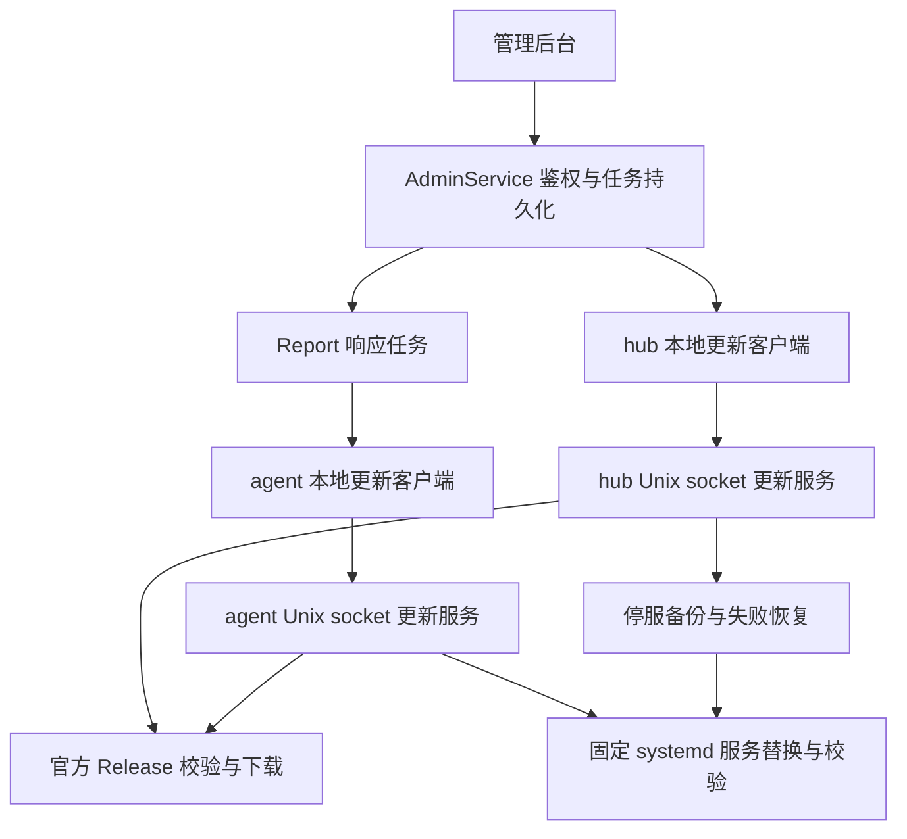

## Goal Capsule

管理员能在后台更新 hub，并向指定节点推送 agent 更新，看到每个目标的真实结果。
使用独立本机更新器、官方 Release 和现有 agent 主动上报链路；不把服务改为 root，也不增加远程 shell。
用户已授权实施，正式发布和生产变更须在受控环境完成验收后执行并回读。
遇到无法安全恢复数据库、无法区分官方产物或实际服务配置不受支持时停止该次更新并显示原因，不猜测操作目标。

---

## Product Contract

### Summary

后台新增更新管理入口，提供官方最新正式版检查、hub 更新、选定节点批量更新及状态回读。

### Problem Frame

当前只能重跑安装器，后台无法执行更新。现有安装器不会备份和回滚，hub 启动时还可能迁移数据库，不能仅替换回旧二进制。
原架构禁止 hub 推代码；本功能显式改变该边界，只授予安装官方正式产物的受限能力。

### Requirements

- R1. 只允许 `xjetry/heron-probe` 官方已发布的正式 Release，不接受自定义仓库、URL、摘要、文件路径或命令。版本采用规范的 `vMAJOR.MINOR.PATCH`，拒绝预发布、草稿、同版本与降级。
- R2. 首版完整支持 Linux systemd 的 hub 和 agent。Docker、OpenRC、macOS、缺少更新器和自定义不受支持安装明确给出原因，不显示可用更新按钮。此范围由用户确认。
- R3. 更新写操作仅允许管理员面板会话；只读 API token 可读状态，但不能创建或取消更新。复用同源检查和现有鉴权，凭据路径不回退。
- R4. 每台机器一次只执行一个任务。任务有唯一 ID、目标版本、创建和过期时间、状态及有限长度错误；重复下发不重复安装，任务记录持久化。离线节点任务等待下一次上报，超过 24 小时不再执行；只允许取消尚未执行的任务。
- R5. 下载和校验期间旧服务继续运行。失败不动旧程序；替换后必须验证实际运行文件与候选摘要一致，agent 新版本成功上报后才算成功。
- R6. hub 停服后备份数据库及 WAL/SHM，候选启动失败时恢复旧程序和数据库。候选确认就绪前不对外接受业务写入，避免回滚抹掉已经接受的修改。
- R7. 服务进程保持非 root 和原加固项。首次启用通过新版安装器安装独立 root 更新服务；后续后台无需 SSH。不假装 v0.2.0 已有自更新能力。
- R8. 后台显示版本、更新能力、进行中状态、失败原因和恢复结果；hub 重启期间提示断连并恢复轮询，不能把请求断开当作成功。

### Scope Boundaries

不执行安装脚本或更新服务定义，不修改 Caddy/CDN。更新器仅替换固定角色二进制，保持既有配置和服务启动参数。
不实现定时无人值守更新、任意版本降级、第三方镜像源、容器控制 socket 或远程命令。
在线更新不自动升级更新器自身；更新器的本地协议版本固定，升级更新器由 root 安装器负责。

---

## Planning Contract

### Key Technical Decisions

- KTD1. 下载器从固定 GitHub API 检查 Release，再从固定官方资产路径取得 `SHA256SUMS` 与对应架构 tar。HTTPS、重定向主机允许列表、响应大小、时限、精确资产名和 SHA-256 均由更新器独立检查。官方账户/Release 发布权限属于信任根；摘要不是独立发布签名。
- KTD2. `heron-updater` 是单独的 Linux systemd 服务，按 hub/agent 角色运行。Unix socket 仅授权对应服务用户；请求体只允许任务 ID、版本和过期时间。固定 `/usr/local/bin/heron-{role}`、固定 systemd 单元、固定 hub 数据目录，不能由请求选择。
- KTD3. root 持有的状态目录存放事务日志、备份与结果。候选文件同目录暂存并 fsync 后原子替换；不从服务用户可写路径读取待执行二进制。归档只提取精确匹配的普通程序文件，不解出服务定义、链接或路径项。
- KTD4. 状态为 queued、downloading、stopping、installing、verifying、succeeded、failed、rolled_back。进入改变程序/数据库之前先持久化恢复信息；更新器启动时先恢复未完成的替换事务，不能把中断任务清成成功。
- KTD5. hub 仅支持安装器的固定数据库路径。停止服务、确认进程退出后，对普通单链接数据库文件进行安全打开和备份。恢复失败保留备份并明确 failed，不继续假定数据完好。
- KTD6. 就绪确认由新程序在完成初始化后通过本地更新协议提交，更新器还独立核对 systemd MainPID 的 `/proc/<pid>/exe` 摘要。允许有界等待 systemd-executor 过渡状态。hub 在批准前不开放业务处理；agent 在成功 Report 后确认。
- KTD7. hub 在数据库存节点任务，在 Report 响应下发；agent 通过同一个本地更新客户端提交和回报。旧 agent 不报告能力即不支持，不根据操作系统猜测已安装更新器。官方版本检查和真实执行失败是分开的状态。
- KTD8. 安装器在 systemd 模式部署更新器、socket 所需目录与权限、systemd 单元；OpenRC/macOS 不安装该特权服务。卸载和 purge 同步处理，仅清除该角色状态，不影响另一角色。

### High-Level Technical Design

### Evidence

`deploy/install.sh`、`deploy/install-hub.sh` 现有逻辑停服后同目录替换，但没有自动回滚。
`README.md` 明确新 hub 可能迁移数据库，旧版不一定能打开。
`proto/heron/v1/agent.proto` 将 ReportResponse 定义为 hub 对 agent 的全部下行，新增能力必须同步更新安全说明。
`internal/hub/ingest/limits_test.go` 按 descriptor 校验消息边界，新增字段必须同步登记。
`scripts/install-accept.sh` 提供 OrbStack 隔离 Linux/systemd 验收模式；官方限定下载的完整验收不能引入可被生产启用的任意源开关。

### Deferred to Implementation

精确 Go 接口、存储列和错误码以实际调用链决定；真实 systemd 验收以独立依赖注入测试程序提供下载产物，不给发行二进制增加任意下载源。

---

## Implementation Units

### U1. 官方发行校验与本地协议

目标：建立 R1、R2、R4 的共用版本、状态和下载语义。
文件：`internal/update/` 实现及测试，`cmd/updater/` 入口。
依赖：无。
验证：拒绝非规范版本、预发布/草稿、恶意重定向、超限响应、摘要不符、重复归档项、链接及路径穿越；合法资产准确提取。每条新增断言须有缺陷注入证据。

### U2. 受限 systemd 更新事务

目标：实现 R5、R6、R7 的程序和数据库恢复边界。
文件：`internal/update/` Linux 平台执行器和故障测试，`deploy/systemd/` 更新服务。
依赖：U1。
验证：下载失败旧服务继续运行；进程启动失败、就绪超时、每个持久化阶段崩溃均正确恢复；数据库与二进制同时回滚；非授权用户不能提交任务；实际运行 exe 摘要与候选一致。

### U3. 后台协议与节点任务生命周期

目标：实现 R3、R4、R8 的管理入口、持久化和 Report 链路。
文件：`proto/heron/v1/`、生成物、`internal/hub/api/`、`internal/hub/store/`、`internal/hub/ingest/`、`internal/agent/client/`、`cmd/hub/serve.go`、`cmd/agent/main.go` 及对应测试。
依赖：U1、U2。
验证：匿名/只读 token 写操作拒绝；离线、过期、取消、重启恢复、重复下发、旧 agent 不支持与批量部分失败；全链路新版本上报才成功。消息预算和 API reference 枚举同步。

### U4. 安装发行与更新管理页面

目标：实现 R2、R7、R8 的首次启用与用户可见流程。
文件：`deploy/install.sh`、`deploy/install-hub.sh`、安装测试、`Makefile`、`web/src/pages/`、路由导航、前端与浏览器测试、`README.md`、架构文档。
依赖：U1、U2、U3。
验证：各 Linux 发行架构有更新器资产；systemd 真正启动且 socket 权限正确；OpenRC/macOS/Docker 显示不支持；后台可创建任务并观察完成/回滚，375px 无横向溢出。

---

## Verification Contract

- Go 测试使用 `-count=1`；新增状态机与安全断言必须缺陷注入验红，恢复后用相同命令验绿。
- `make gen` 后生成物无漂移；`make lint`、`make test`、`make script-test`、`make build`、前端全量与 `make web-e2e` 通过。生成前端时不并发运行依赖 Go embed 的检查。
- 在独立 OrbStack systemd 环境执行真实更新、启动失败回滚和更新器中断恢复，不用生产主机充当实验环境。
- 发布前检查实际 tar 成员、摘要和架构；发布后回读 tag、latest 和产物摘要。生产部署后回读版本、进程 hash、节点上报与更新能力。

## Definition of Done

四个实现单元全部覆盖需求与失败路径，官方更新来源不可由管理请求绕过，真实 systemd 更新和回滚有证据，后台能看到准确结果，安装文档和安全边界已同步。
不得仅以按钮出现、编译通过或下载成功宣称完成。若尚未发布新版，明确区分本地验收与线上可用。
